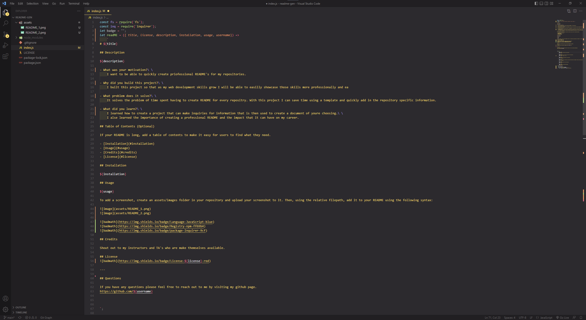
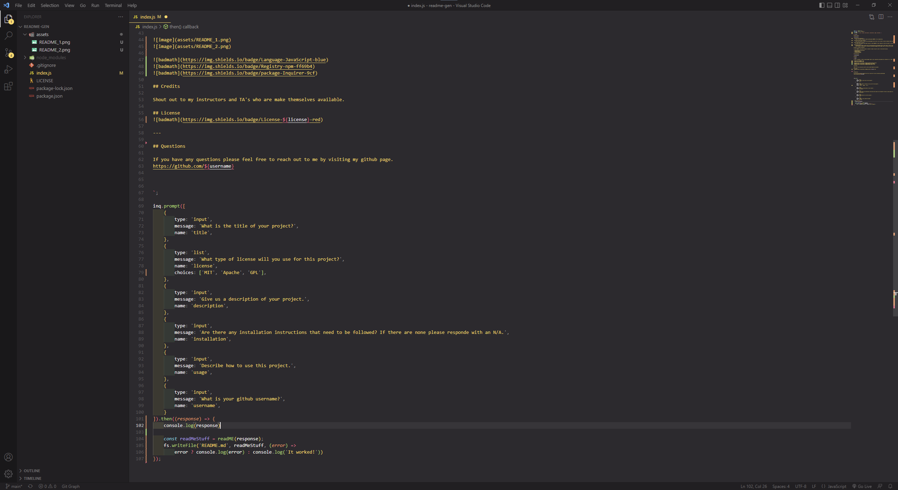

# README Generator

## Description

It is used to create README's more easily.

- What was your motivation?  
    I want to be able to quickly create priofessional README's for my repositories.

- Why did you build this project?  
    I built this project so that as my web development skills grow I will be able to easilly showcase those skills more professionally and ea

- What problem does it solve?  
    It solves the problem of time spent having to create README for every repositry. With this project I can save time using a template and quickly add in the repository specific information.

- What did you learn?  
    I learned how to create a project that can make inquiries for information that is then used to create a document of youre choosing.  
    I alse learned the importance of creating a professional README and the impact that it can have on my career.

## Table of Contents (Optional)

If your README is long, add a table of contents to make it easy for users to find what they need.

- [Installation](#installation)
- [Usage](#usage)
- [Credits](#credits)
- [License](#license)

## Installation

N/A

## Usage

You will answer some questions and your answers are used to populate the README.

To add a screenshot, create an assets/images folder in your repository and upload your screenshot to it. Then, using the relative filepath, add it to your README using the following syntax:

https://app.castify.com/view/ff82f821-1c6d-436d-98c2-feb4cbb5d294

## Credits

Shout out to my instructors and TA's who are make themselves available. 

## License

---

## Questions

If you have any questions please feel free to reach out to me by visiting my github page.
https://github.com/sergluna

